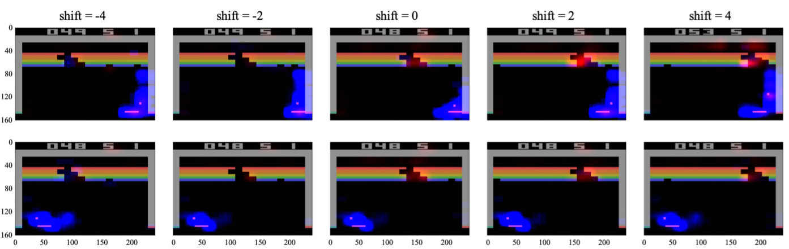

Exploratory Not Explanatory: Counterfactual Analysis of Saliency Maps for Deep Reinforcement Learning
=====================================================================================================

Paper : *Exploratory Not Explanatory: Counterfactual Analysis of Saliency Maps for Deep Reinforcement Learning*, Akanksha Atrey, Kaleigh Clary, David Jensen (ICLR 2020)

Lots of recent approches in XRL use saliency maps as a tool for explaning the behavior of deep reinforcement agent, but the way they are used is subject to subjectivity and sometimes unfalsifiability. The paper introduces an empirical coutenfactual reasining approach to test and verify the semantic relationship hypotheses claimed by the generated "explanations" interpolated from saliency map.

Notes from the Introduction
***************************

Saliency-Map = *popular visualization technique that produce heatmap-like output high-lighting of different regions of some visual input* (GradCam, LIME, ...)

Different challenge in RL due to its temporal and interactive nature. The sequential decision-making contrasts with the visual classification tasks in DL. Not corresponding literature for evaluatinf the applicability of saliency maps in RL.

Overview : 

- survey of saliency map usage in XRL

- description of a new method to evaluate the saliency map inferences of explanations

- experimental evaluation of the pixel-semantic relation inference of saliency maps

Survey 
******

Four main types of saliency maps in the litterature : 

- Jacobian Saliency (Wang et al, 2016) : compute the Jacobian of the output logits wrt the input observation - gradient-based saliency map.

- Perturbation Saliency (Greydanus et al, 2017) : perturbe the original observation with Gaussian blur to measure the impact of localized incertainty/missing information on the network policy.

- Object Saliency (Iyer et al, 2018) : use of template machine (see article) to detect objects within an image and measure salience through changes in Q-values
for masked and unmasked objects.

- Attention Saliency (Mott et al , 2019 / Nikulin et al, 2019)

